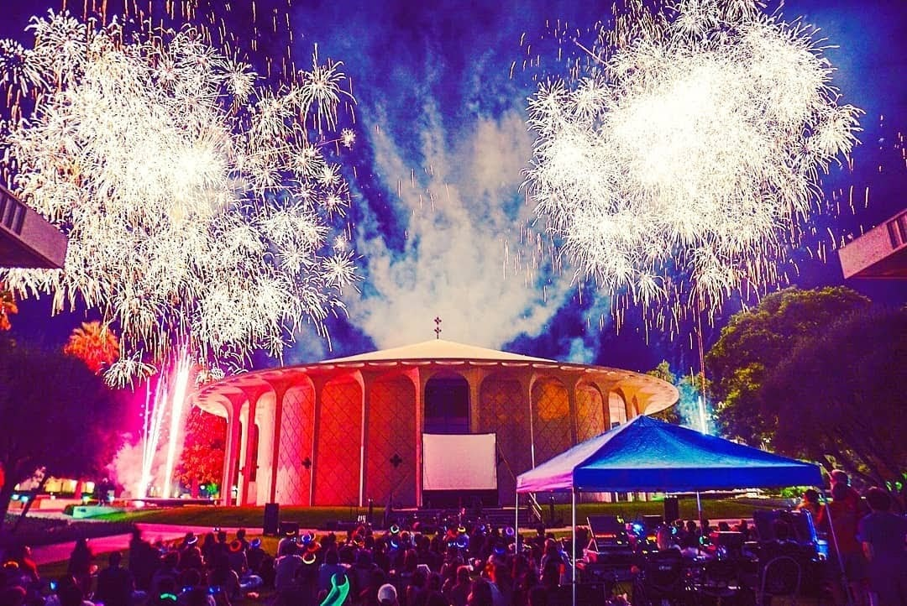

## A System for Detecting Software Similarity: MOSS
Moss (for a Measure Of Software Similarity) is an automatic system for determining the similarity of programs.
Steps to run MOSS on Linux:

To obtain a Moss account, send a mail message to moss@moss.stanford.edu. The body of the message should appear exactly as follows:
registeruser 
mail username@domain

You will then get a reply containing the script that you will need to save as “moss.pl”. Just make sure that your system has the “perl” folder within the “/usr/bin/“ folder or change the path of the perl folder on the very first line of the script to be compatible to your machine.

Now set the execute permission using the command “chmod ug+x moss.pl”. This should allow you to send your queries to the Stanford server. 

Now submit the query to the server using the command similar to the following "./moss.pl -l cc -c "Run moss lab3b" -d TestMoss/&*/&*.cpp". Here -l is used to set the language which is C++ in the above case, -c is for the caption (optional) and -d is used to specify the directory. Note that &* is used to consider all such files. In the above example, within the TestMoss folder consider all folders and within them look for all .cpp files.

The result on submitting a query such as above would be:
Checking files . . . 
OK  
Uploading.....................................  
Uploading.....................................  
Uploading.....................................  
Uploading.....................................  
Uploading.....................................  
.
.
.
.
Query submitted.  Waiting for the server's response.  
http://moss.stanford.edu/results/989790299  

## Good Movies
<ul>
  <li>Fireworks Wednesday</li>
  <li>About Elly</li>
  <li>The Past</li>
  <li>A Seperation</li>
  <li>Tere Bin Laden</li>
  <li>No Smoking</li>
  <li>Shutter Island</li>
  <li>Ugly</li>
  <li>Hell or High Water</li>
  <li>Titli</li>
  <li>Aamir</li>
  <li>Mulk</li>
</ul>

## Big Ideas Finalist
Our team has been selected as a finalist in the 2018-2019 <a href="https://bigideas.berkeley.edu/">Big Ideas Contest</a> organized by UC Berkley in the Connected Communities category. We are among the 50 teams selected for the final round of this yearlong innovation contest. We have prototyped the technology and tested it for one specific use case. We are excited to work under the Big Ideas mentorship to map out the business model and logistical requirements.

## Santa Monica Pier
This is my favorite place in California. I love the enthusiasm and briskness around here. I have been there four times and still, it is not enough. It's not about the beaches (I mean come on, I am from the campus which has its own beach). Every time this place has some surprise planted for me. From an excellent musical show to incredible magic play and from city contour during sunrise to sun dropping in the sea, this place is a stretch of beauty. I saw a sea lion on my recent visit!

## Death Valley
If you love impeccable white snow but hate the cold!!!
Don't be panicked by the title, you will be fine.
Badwater basin (not at all bad) is almost 300 ft below the sea level. Do check out the sea level sign in the nearby mountain. The place was surprisingly beautiful. Besieged by the vast landscape of white salt crust and bounded by the far reached mountains, I was feeling heavenly. Remembering the taste of salt...

## A warm welcome
Thank you, Caltech!

Picture credit: Welai Lu
