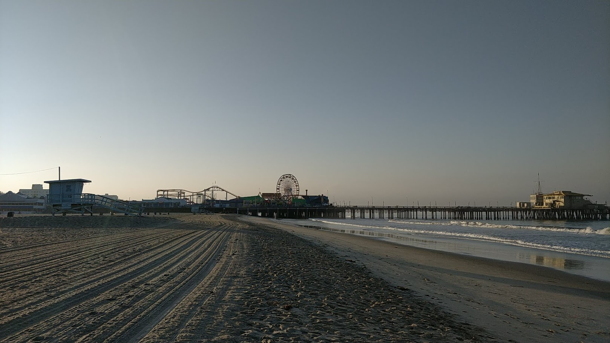

This is my favorite place in California. I love the enthusiasm and briskness around here. I have been there four times and still, it is not enough. It's not about the beaches (I mean come on, I am from the campus which has its own beach). Every time this place has some surprise planted for me. From an excellent musical show to incredible magic play and from city contour during sunrise to sun dropping in the sea, this place is a stretch of beauty. I saw a sea lion on my recent visit!

